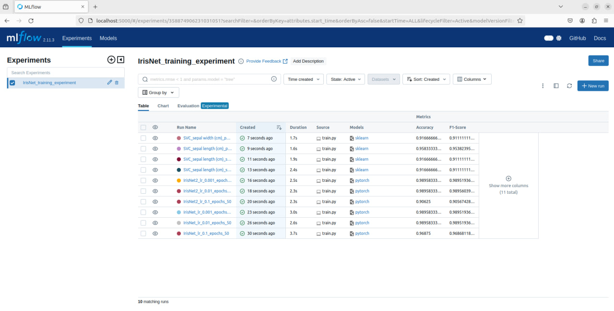
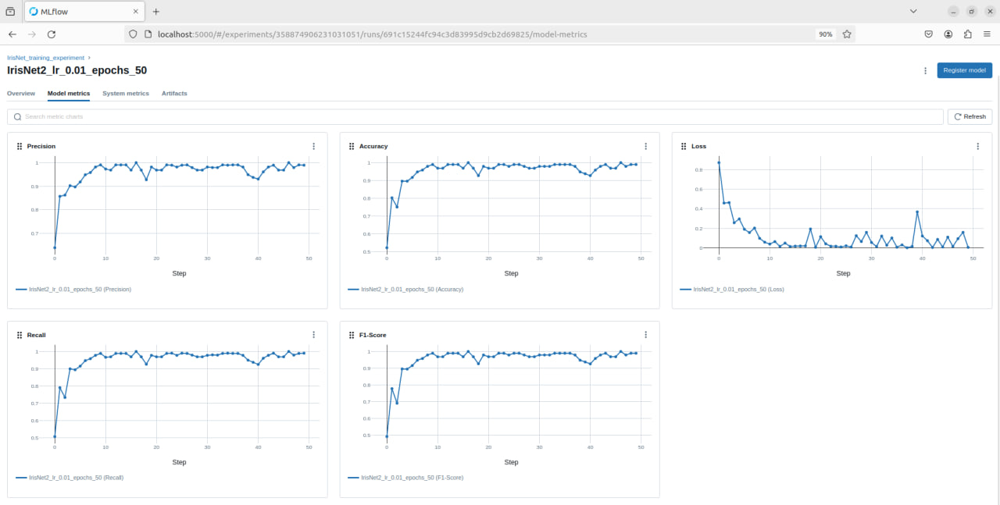
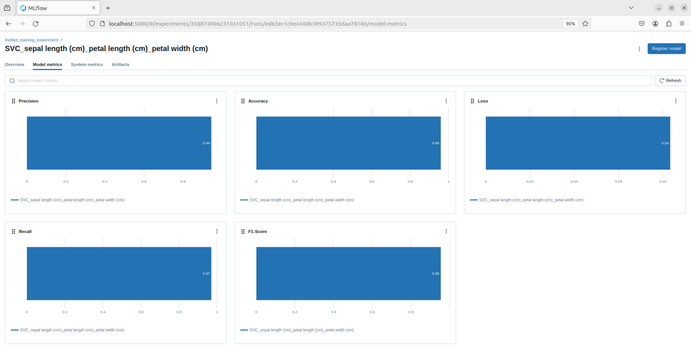
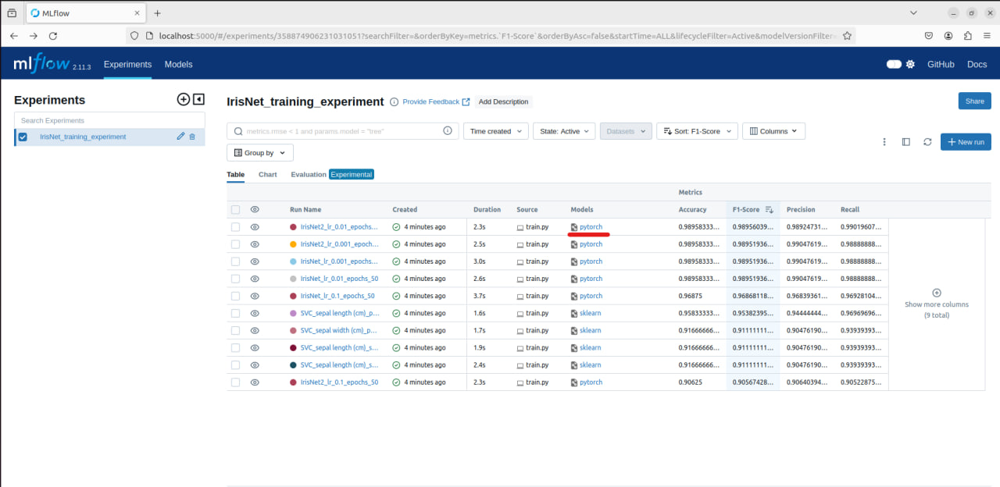
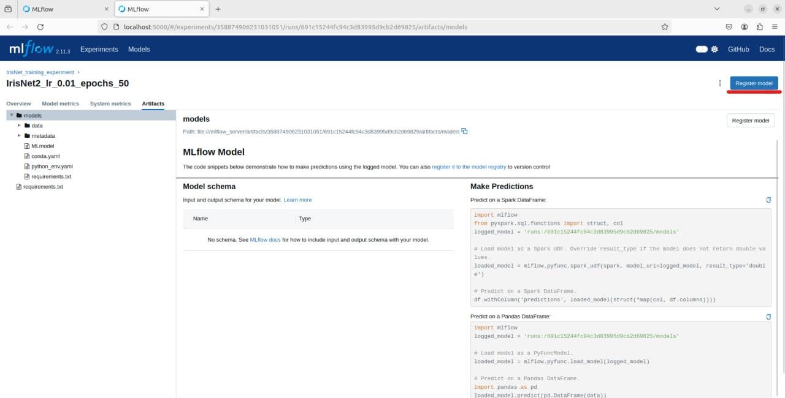
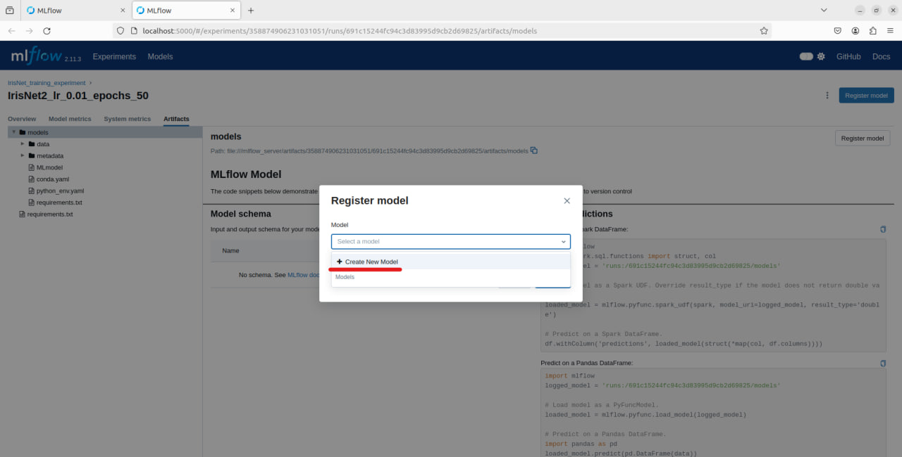
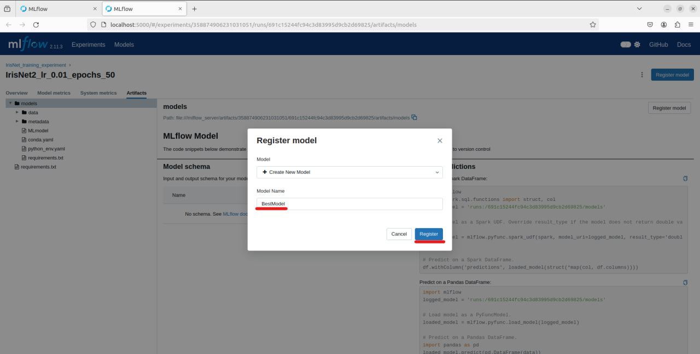
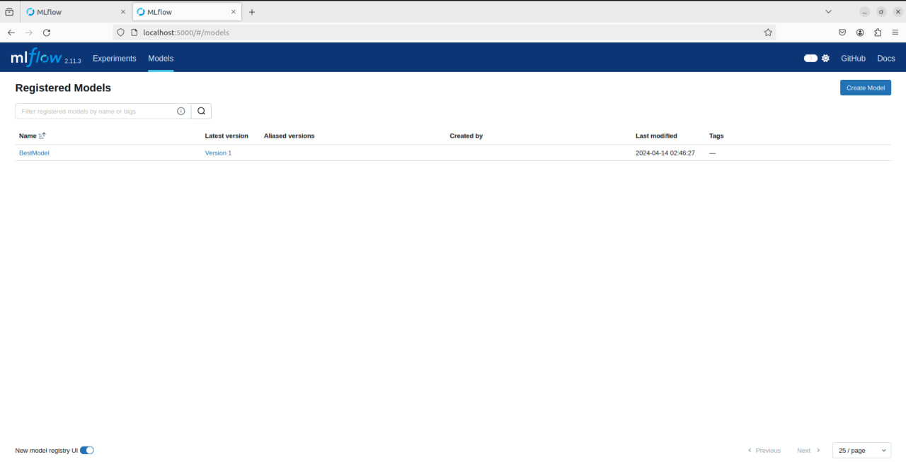
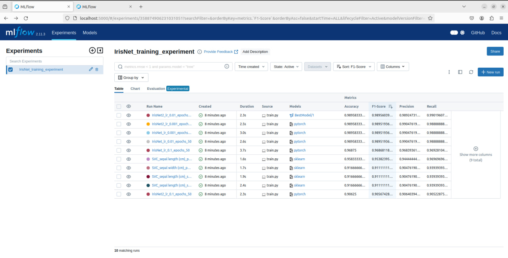

## Planning the experiment 

In this problem, I experimented with different modeling strategies:

- Two different neural network architectures (`IrisNet` and `IrisNet2`)
- SVC (support vector classification)
- I used different sets of features and observed the changes in model metrics.
- I conducted several experiments with different hyperparameters and tracked them in MLFlow 

## Cloning the Repository

First, clone the repository from GitHub using the following command:
```bash
git clone https://github.com/ValeriiZghurovskyi/EPAM-MLE-lab
```

## Data loading
1. Navigate to the `EPAM-MLE-lab` folder:
```bash
cd EPAM-MLE-lab
```

2. Navigate to the `Module 3. Experiment tracking` folder:
```bash
cd 'Module 3. Experiment tracking'
```

3. Run the script to download the model and test files:
```bash
python3 data_process/data_generation.py
```

## Build docker containers

Given we have docker-compose and Docker installed in our local machine, we can build and run this application via the following command in the terminal:
```bash
docker-compose up
```
The MLFlow server will be started and the training script will be executed. After training is done, model`s artifacts will be stored in mlflow server.

## Access MLFlow Dashboard

You can open your favorite web browser and type:
```
localhost:5000
```

You should see the MLFlow dashboard. 


## Results and Visualization


The result of each run can be seen on the 'Runs' table. By clicking on a specific run, you get more details of that specific run such as parameters, metrics, artifacts etc.
Metrics such as Loss, Accuracy, Precision, Recall, and F1-Score are logged for each run:


You can also see the neural network metrics during training and their progress with each epoch in detail:


You can also view the metrics of another model:


## Register the best model

To determine the best model, we must first decide what "best" means to us. The final choice of model depends on the balance between different metrics, as well as the specific problem we are trying to solve.

If we consider only the Accuracy metric, we have several models with the same accuracy. However, accuracy is only one of the metrics. Other metrics, such as Precision, Recall, and F1-Score, are also worth considering.

If we want to find the model with the highest performance in all metrics, we should pay attention to IrisNet2_lr_0.01_epochs_50, as it demonstrates a high Accuracy of 0.98958 and a high F1-Score of 0.98956, which indicates a well-balanced Precision and Recall.

Therefore, in my opinion, IrisNet2_lr_0.01_epochs_50 is the best model for our task.


1. To register our model, we need to select it in the runs list:


2. Here you can see various artifacts of the model. We need to click the "Register model" button:


3. Click "Create a new Model":


4. Enter the desired model name and click the "Register" button:


5. Now we have the best model registered:

