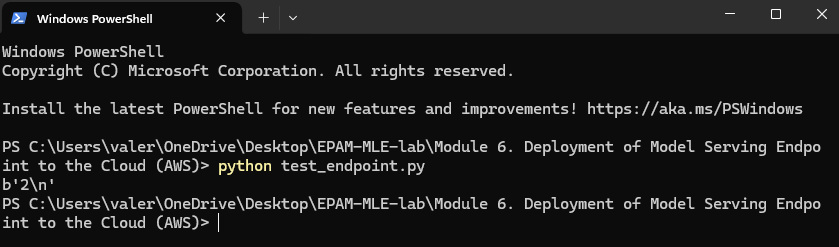
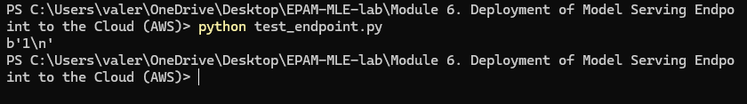

# Deployment of Model Serving Endpoint to the Cloud

Here's a step-by-step guide on how to deploy model serving endpoint to the cloud

1. **Set up an AWS account**. You first need an AWS account and an AWS Identity and Access Management administrator user. For instructions on how to set up an AWS account, see [How do I create and activate a new AWS account?](https://repost.aws/knowledge-center/create-and-activate-aws-account).

2. **Create an Amazon S3 bucket**. You use an Amazon S3 bucket to store your model artifacts. To learn how to create a bucket, see [Create your first S3 bucket](https://docs.aws.amazon.com/AmazonS3/latest/userguide/creating-bucket.html) in the Amazon S3 User Guide.

3. **Upload your model artifacts to your S3 bucket**. For instructions on how to upload your model to your bucket, see [Upload an object to your bucket](https://docs.aws.amazon.com/AmazonS3/latest/userguide/uploading-an-object-bucket.html) in the Amazon S3 User Guide.

We upload our model to our created "testepambucket" in "model_artifacts" folder

4. **Create an IAM role for Amazon SageMaker**. Amazon SageMaker needs access to the S3 bucket that stores your model. Create an IAM role with a policy that gives SageMaker read access to your bucket.
   
a. Sign in to the IAM console.

b. In the navigation tab, choose Roles.

c. Choose Create Role.

d. For Select type of trusted entity, choose AWS service and then choose SageMaker.

e. Choose Next: Permissions and then choose Next: Tags.

f. Choose Next: Review.

g. For Role name, enter a name for the new role that is unique within your AWS account. You cannot edit the role name after creating the role.

h. (Optional) For Role description, enter a description for the new role.

i. Choose Create role.

5. **Attach S3 bucket permissions to your SageMaker role**. After creating an IAM role, attach a policy that gives SageMaker permission to access the S3 bucket containing your model artifacts.

a. In the IAM console navigation tab, choose Roles.

b. From the list of roles, search for the role you created in the previous step by name.

c. Choose your role, and then choose Attach policies.

d. For Attach permissions, choose Create policy.

e. In the Create policy view, select the JSON tab.

f. Add the following policy statement into the JSON editor. Make sure to replace `<your-bucket-name>` with the name of the S3 bucket that stores your model artifacts. If you want to restrict the access to a specific folder or file in your bucket, you can also specify the Amazon S3 folder path, for example, `<your-bucket-name>`/`<model-folder>`.
```
{
    "Version": "2012-10-17",
    "Statement": [
        {
            "Sid": "VisualEditor0",
            "Effect": "Allow",
            "Action": "s3:GetObject",
            "Resource": "arn:aws:s3:::<your-bucket-name>/*"
        }
    ]
}
```

g. Choose Next: Tags.

h. (Optional) Add tags in key-value pairs to the policy.

i. Choose Next: Review.

j. For Name, enter a name for the new policy.

k. Choose Create policy.

l. After creating the policy, return to Roles in the IAM console and select your SageMaker role.

m. Choose Attach policies.

n. For Attach permissions, search for the policy you created by name. Select it and choose Attach policy.

6. **We need to build our Docker container**. Clone repository using next command:
```
git clone https://github.com/ValeriiZghurovskyi/EPAM-MLE-lab
```

go to the `Module 6. Deployment of Model Serving Endpoint to the Cloud (AWS)` folder:
```
cd Module 6. Deployment of Model Serving Endpoint to the Cloud (AWS)
```
go to the `app` folder:
```
cd app
```
build docker:
```
docker build -t <my_docker_image> .
```
> I used: docker build -t my_model .

7. **Uploading a Docker container to AWS ECR**. Create a repository in ECR using the following command:
```
aws ecr create-repository --repository-name <my-repository>
```
> I used: aws ecr create-repository --repository-name my_model

Tag your Docker image:
```
docker tag <my_docker_image>:latest <account_id>.dkr.ecr.<region>.amazonaws.com/<my-repository>:latest
```
> I used: docker tag my_model:latest 637423199688.dkr.ecr.eu-north-1.amazonaws.com/my_model:latest

Upload your Docker container to the ECR repository using:
```
docker push <account_id>.dkr.ecr.<region>.amazonaws.com/<my-repository>:latest
```
> I used: docker push 637423199688.dkr.ecr.eu-north-1.amazonaws.com/my_model:latest

8. **Create a model in SageMaker**. There are two ways to do this:

a. In the AWS console, select SageMaker and navigate to the Models page.

Click Create Model, enter the model name, your SageMaker role ARN, and the URI of the Docker repository in the ECR.

b. You can do this by running the file `create_model.py`

go to the `Module 6. Deployment of Model Serving Endpoint to the Cloud (AWS)` folder if you are not already in it:
```
cd Module 6. Deployment of Model Serving Endpoint to the Cloud (AWS)
```
run:
```
python create_model.py
```

9. **Deploying the model in SageMaker**.There are two ways to do this:
a. In SageMaker, go to the Endpoints page and click Create Endpoint.

Select your model and click Deploy.

b. You can do this by running the file `create_endpoint.py`

go to the `Module 6. Deployment of Model Serving Endpoint to the Cloud (AWS)` folder if you are not already in it:
```
cd Module 6. Deployment of Model Serving Endpoint to the Cloud (AWS)
```
run:
```
python create_endpoint.py
```

10. **Endpoint testing**. Using boto3, we can make a request to our endpoint. You can do this by running the file `test_endpoint.py`

go to the `Module 6. Deployment of Model Serving Endpoint to the Cloud (AWS)` folder if you are not already in it:
```
cd Module 6. Deployment of Model Serving Endpoint to the Cloud (AWS)
```
run:
```
python test_endpoint.py
```

I ran this code twice with different parameters to make sure it works:

First run:


Second run:


11. **Delete Endpoint**. You can do this by running the file `delete_endpoint.py`

go to the `Module 6. Deployment of Model Serving Endpoint to the Cloud (AWS)` folder if you are not already in it:
```
cd Module 6. Deployment of Model Serving Endpoint to the Cloud (AWS)
```
run:
```
python delete_endpoint.py
```

12. **Delete image from ECR and files from S3**.

To delete an image from ECR:
* Go to AWS Management Console and open Amazon ECR.
* Select the desired repository.
* Select the images you want to delete and select Delete.


To delete files from S3:

* Go to AWS Management Console and select S3.
* Open your bucket and navigate to the folder with the files you want to delete.
* Select the files and choose Delete.
